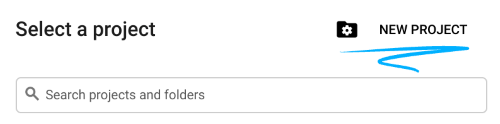
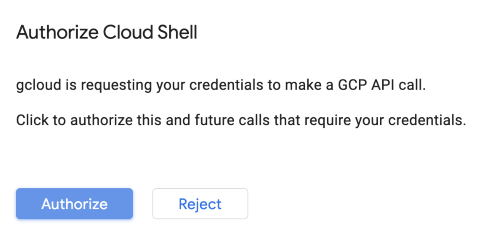
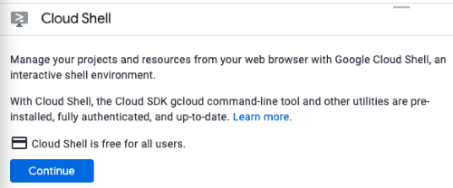
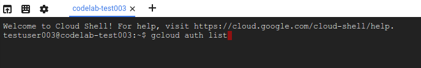
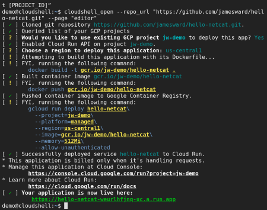

summary: Deploy with GCP
id: docs
categories: Tutorial
tags: RPT
status: Published
authors: Kang
Feedback Link: https://github.com/kangyuw/pop_documentation

# Deploy with GCP
<!-- ------------------------ -->
## Introduction 
Duration: 3

### What You’ll Learn

Welcome to ```TBD```!

Let's get to know how GCP - Google Cloud Platform help developers to deploy their projects with automatically pipeline.

This event will walk through the following steps.

- Create a new project on GCP
- Deploy the microservice on Cloud Run
- Buildup automatic pipeline on Cloud Run

At the end of the event, you have to submit your microservice to the **Leaderboard**.

#### Microservice Rainbow Rumpus

The host will send the HTTP POST request. And the microservice should response with the following JSON structure:

```JSON
{
  "_links": {
    "self": {
      "href": "https://YOUR_SERVICE_URL"
    }
  },
  "arena": {
    "dims": [4,3], // width, height
    "state": {
      "https://A_PLAYERS_URL": {
        "x": 0, // zero-based x position, where 0 = left
        "y": 0, // zero-based y position, where 0 = top
        "direction": "N", // N = North, W = West, S = South, E = East
        "wasHit": false,
        "score": 0
      }
      ... // also you and the other players
    }
  }
}
```

Your HTTP response must be status code 200 (OK) with a response body containing your next move, encoded as a single uppercase character of either:

``` console
F <- move Forward
R <- turn Right
L <- turn Left
T <- Throw
```

That's all there is to it! Let's walk through deploying a microservice on Cloud Run, a Google Cloud service for running microservices and other applications.

<!-- ------------------------ -->
## Login to Google Cloud
Duration: 5

To be able to deploy your microservice on Cloud Run you will need to login to Google Cloud. We will apply a credit to your account and you won't need to enter a credit card. It is usually less problematic to use a personal account (e.g. gmail.com) instead of a GSuite account because sometimes GSuite admins prevent their users from using certain Google Cloud features. Also, the web console we will be using should work great with Chrome or Firefox but might have issues in Safari.

[Get started and login](http://www.google.com)

<!-- ------------------------ -->
## Create a new Project
This section covers everything you need to do to get started with this event.

### Environment setup

Sign in to [Cloud Console](console.cloud.google.com) and create a new project.





Remember the project ID, a unique name across all Google Cloud projects. It will be referred to later in this codelab as ```PROJECT_ID```.

Be sure to follow any instructions in the "Cleaning up" section which advices you how to shut down resources so you don't incur billing beyond this event. New users of Google Cloud are eligible for the [$300 USD Free Trial](https://cloud.google.com/free) program.

### Start Cloud Shell

In this event you're going to work in a [Cloud Shell](https://cloud.google.com/shell) session, which is a command interpreter hosted by a virtual machine in Google's cloud. You could just as easily run this section locally on your own computer, but using Cloud Shell gives everyone access to a reproducible experience in a consistent environment.

Positive
: **Note**: The first time you make a request in Cloud Shell requiring authorization, you will see an "Authorize Cloud Shell" dialog like the one shown below, to which you may safely click the "Authorize" button.



#### Activate Cloud Shell

1. From the Cloud Console, click Activate Cloud Shell


If you've never started Cloud Shell before, you're presented with an intermediate screen (below the fold) describing what it is. If that's the case, click **Continue** (and you won't ever see it again). Here's what that one-time screen looks like:



It should only take a few moments to provision and connect to Cloud Shell.



This virtual machine is loaded with all the development tools you need. It offers a persistent 5GB home directory and runs in Google Cloud, greatly enhancing network performance and authentication. Much, if not all, of your work in this codelab can be done with simply a browser or your Chromebook.

Once connected to Cloud Shell, you should see that you are already authenticated and that the project is already set to your project ID.

2. Run the following command in Cloud Shell to confirm that you are authenticated:

``` console
gcloud auth list

```

**Command output**
``` console
 Credentialed Accounts
ACTIVE  ACCOUNT
*       <my_account>@<my_domain.com>

To set the active account, run:
    $ gcloud config set account `ACCOUNT`
```

Positive
: **Note**: For more information about ```gcloud``` command-line tool, see [gcloud command-line tool overview](https://cloud.google.com/sdk/gcloud/).

1. Run the following command in Cloud Shell to confirm that the gcloud command knows about your project:

``` console
gcloud config list project
```

**Command output**
``` console
[core]
project = <PROJECT_ID>
```

If it is not, you can set it with this command:

``` console
gcloud config set project <PROJECT_ID>
```

**Command output**
``` console
Updated property [core/project].
```

OK, now you are ready to deploy the microservice!

<!-- ------------------------ -->
## Deploy Your Microservice

You can build your microservice with any technology and deploy it anywhere as long as it is reachable publicly and conforms to the API. But to make things easy we will help you start from a sample service and deploy it on Cloud Run.

#### Pick Your Sample to Start with

<!-- TODO: This part should contain our own setup samples -->
There are numerous sample microservices you can start from:

|Sample|Description|Deploy|
|---|---|---|
|[go](go)|Go Lang|[Run on Google Cloud](https://deploy.cloud.run/?git_repo=https://github.com/GoogleCloudPlatform/cloudbowl-microservice-game.git&dir=samples/go)|
|[java-quarkus](java-quarkus)|Java + Quarkus|[Run on Google Cloud](https://deploy.cloud.run/?git_repo=https://github.com/GoogleCloudPlatform/cloudbowl-microservice-game.git&dir=samples/java-quarkus)|
|[java-springboot](java-springboot)|Java + Spring Boot|[Run on Google Cloud](https://deploy.cloud.run/?git_repo=https://github.com/GoogleCloudPlatform/cloudbowl-microservice-game.git&dir=samples/java-springboot)|
|[kotlin-micronaut](kotlin-micronaut)|Kotlin + Micronaut|[Run on Google Cloud](https://deploy.cloud.run/?git_repo=https://github.com/GoogleCloudPlatform/cloudbowl-microservice-game.git&dir=samples/kotlin-micronaut)|
|[kotlin-quarkus](kotlin-quarkus)|Kotlin + Quarkus|[Run on Google Cloud](https://deploy.cloud.run/?git_repo=https://github.com/GoogleCloudPlatform/cloudbowl-microservice-game.git&dir=samples/kotlin-quarkus)|
|[kotlin-springboot](kotlin-springboot)|Kotlin + Spring Boot|[Run on Google Cloud](https://deploy.cloud.run/?git_repo=https://github.com/GoogleCloudPlatform/cloudbowl-microservice-game.git&dir=samples/kotlin-springboot)|
|[nodejs](nodejs)|Node.js|[Run on Google Cloud](https://deploy.cloud.run/?git_repo=https://github.com/GoogleCloudPlatform/cloudbowl-microservice-game.git&dir=samples/nodejs)|
|[python](python)|Python + Flask|[Run on Google Cloud](https://deploy.cloud.run/?git_repo=https://github.com/GoogleCloudPlatform/cloudbowl-microservice-game.git&dir=samples/python)|
|[scala-play](scala-play)|Scala + Play Framework|[Run on Google Cloud](https://deploy.cloud.run/?git_repo=https://github.com/GoogleCloudPlatform/cloudbowl-microservice-game.git&dir=samples/scala-play)|

After you decide which sample to start with, click the "Deploy on Cloud Run" button above. This will launch [Cloud Shell](https://cloud.google.com/shell) (a web-based console to a virtual machine in the cloud) where the source will be cloned, then built into a deployable package (a docker container image), which is then uploaded to the [Google Container Registry](https://cloud.google.com/container-registry), and then deployed on [Cloud Run](https://cloud.google.com/run).

When asked, specify the ```us-central1``` region.

The screenshot below shows Cloud Shell output for microservice build and deployment



#### Verify the microservice works

In Cloud Shell you can make a request to your newly deployed microservice, replacing YOUR_SERVICE_URL with the URL for your service (which is in Cloud Shell after the "Your application is now live here" line):

<!-- TODO: This part should be replace by simple http post request -->

``` console
curl -d '{
  "_links": {
    "self": {
      "href": "https://foo.com"
    }
  },
  "arena": {
    "dims": [4,3],
    "state": {
      "https://foo.com": {
        "x": 0,
        "y": 0,
        "direction": "N",
        "wasHit": false,
        "score": 0
      }
    }
  }
}' -H "Content-Type: application/json" -X POST -w "\n" \
  https://YOUR_SERVICE_URL
```

You should see the response string of either ```F```, ```L```, ```R```, or ```T```.

<!-- ------------------------ -->
## Make & Deploy Changes

Before you can make changes you need to setup some information in Cloud Shell about the GCP project and the sample you used. First list your GCP projects:

``` console
gcloud projects list
```

Copy the newly created ```PROJECT_ID``` from the first column and paste it into the following command (replacing ```YOUR_PROJECT_ID``` with your actual Project ID), in order to set an environment variable that we will use in later commands:

``` console
export PROJECT_ID=YOUR_PROJECT_ID
```

Now set another environment variable for the sample you used so in later commands we can specify the correct directory and service name:

<!-- TODO: Those should be replace by our own samples -->
``` console
# Copy and paste ONLY ONE of these
export SAMPLE=kotlin-micronaut
export SAMPLE=kotlin-quarkus
export SAMPLE=kotlin-springboot
export SAMPLE=java-quarkus
export SAMPLE=java-springboot
export SAMPLE=go
export SAMPLE=nodejs
export SAMPLE=python
```

Now, you can edit the source for your microservice from within Cloud Shell. To open the Cloud Shell web-based editor, run this command:

``` console
cloudshell edit cloudbowl-microservice-game/samples/$SAMPLE/README.md
```
You will then see the editor and you can make change there.


*Cloud Shell with the editor with the sample project open*

After saving your changes, make sure you are in the correct sample directory in Cloud Shell:

**Important**: Make sure you run this command in the **same** terminal you set for ```$PROJECT_ID``` and ```$SAMPLE```.

``` console
cd cloudbowl-microservice-game/samples/$SAMPLE
```

Then run the command in the ```README.md``` file, for instance:
``` console
# Python Flask
pip install -r requirements.txt
python3 main.py
```

Once the application is running, send a HTTP POST request to the local port in other terminal tab:

<!-- TODO: This command should be replace by simple post request -->

``` console
curl -d '{
  "_links": {
    "self": {
      "href": "https://foo.com"
    }
  },
  "arena": {
    "dims": [4,3],
    "state": {
      "https://foo.com": {
        "x": 0,
        "y": 0,
        "direction": "N",
        "wasHit": false,
        "score": 0
      }
    }
  }
}' -H "Content-Type: application/json" -X POST -w "\n" \
  http://localhost:8080
```

You should see the response string of either ```F```, ```L```, ```R```, or ```T```.

When you are ready to deploy your changes, build your project in Cloud Shell using the ```pack``` command. This command uses Buildpacks to detect the project type, compile it, and create the deployable artifact (a docker container image).

``` console
# Make sure you are in a Cloud Shell tab where you set the PROJECT_ID
# and SAMPLE env vars. Otherwise, set them again.
pack build gcr.io/$PROJECT_ID/$SAMPLE \
  --path ~/cloudbowl-microservice-game/samples/$SAMPLE \
  --builder gcr.io/buildpacks/builder
```

Now that your container image has been created, use the docker command (in Cloud Shell) to push the container image to the Google Container Registry so that it can then be accessed by Cloud Run:

``` console
docker push gcr.io/$PROJECT_ID/$SAMPLE
```

Now deploy the new version on Cloud Run:
```
gcloud run deploy $SAMPLE \
          --project=$PROJECT_ID \
          --platform=managed \
          --region=us-central1 \
          --image=gcr.io/$PROJECT_ID/$SAMPLE \
          --allow-unauthenticated
```
Now the Leaderboard will use your new version!

<!-- ------------------------ -->
## Delivery

##### Set up Source Code Management

Setup GitHub so you can collaborate with your team on your microservice:

1. [Login to GitHub](https://github.com/)

2. [Create a new repo](https://github.com/new)

##### Push your code with the git CLI

1. Follow the [git over https with a personal access token instructions](https://docs.github.com/en/github/authenticating-to-github/creating-a-personal-access-token)

2. Choose "repo" scope

3. Setup git:
```
git config --global credential.helper \
  'cache --timeout=172800'
git config --global push.default current
git config --global user.email "YOUR@EMAIL"
git config --global user.name "YOUR NAME"
```

4. Set environment variables for the GitHub org and repo ```https://github.com/ORG/REPO```

``` console
export GITHUB_ORG=YOUR_GITHUB_ORG
export GITHUB_REPO=YOUR_GITHUB_REPO
```

5. Push your code to the new repo

``` console
# Make sure the SAMPLE env var is still set. If not, re-set it.
cd ~/cloudbowl-microservice-game/samples/$SAMPLE
git init
git add .
git commit -m init
git remote add origin https://github.com/$GITHUB_ORG/$GITHUB_REPO.git
git branch -M main

# This will now ask for your GitHub username & password
# for the password use the personal access token
git push -u origin main
```

6. After making any changes you can commit and push the changes to GitHub:

``` console
git add .
git status
git diff --staged
git commit -am "my changes"
git push
```

Now you can ```git clone``` from the repo to your local machine and edit the code there. Just make sure before make any change, ```git pull``` first to ensure the consistency of the code version. 

##### Setup Cloud Run Continuous Deployment

With your SCM setup on GitHub you can now setup Continuous Delivery so that every time new commits are pushed to the ```main``` branch, Cloud Build will automatically build and deploy the changes. You can also add Continuous Integration which runs your tests before deploying, but that step has been left as an exercise for you since the out-of-the-box samples do not contain any tests.

1. [In the Cloud console](https://console.cloud.google.com/run), go to your Cloud Run service
2. Click the "SET UP CONTINUOUS DEPLOYMENT" button
3. Authenticate with GitHub and select your microservice's repository


In this step, you might have to install Cloud Built App on GitHub.

4. Select your GitHub repo and set the branch to: ```^main$```


5. Set the Build Type to use Buildpacks

6. Click Save to setup Continues Deployment

If the build success there should be a litter check mark in the repo


If you encounter any problem during the build, you could always check the logs in your [Cloud Run Console](https://console.cloud.google.com/run)

<!-- ------------------------ -->
## Join the Rainbow Rumpus

Congratulations, you've successfully built and deployed a microservice.

Now is time to test your microservice on the Rainbow Rumpus.

1. Visit the [Google I/O Adventure](https://events.google.com/io/adventure?lng=en)
2. Create your Avatar
3. Visit Google Cloud Dome


4. Reach to the Rainbow Rumpus dashboard


  Your should be redirected to [rainbowrumpus.dev](https://rainbowrumpus.dev/)

5. Join the game with your ID and microservice URL
6. Now you should see your avatar in the arena

<!-- ------------------------ -->
## Observability

Things break. Observability gives us the ability to know when that happens and diagnose why. Metrics show us data about the health and usage of our service. Logs shows us the manually instrumented information emitted from our service. Alerts allow us to be notified when something goes wrong. Let's explore each of those further.

##### Metrics

1. Find your service in the [list of Cloud Run services](https://console.cloud.google.com/run)
2. Click on your service's name to visit it's metric dashboard


3. Click on a metric's ⋮ menu, then select "View in Metrics Explorer"
4. You can now change resource metrics, filters, grouping, and other options.


##### Logs

STDOUT output from services is sent to the Google Cloud Logging system. You can access a basic log view from the Cloud Run service admin page, like:


In the Cloud Run logs you can filter by severity and filter the logs. For more flexibility click: 

<!-- ------------------------ -->

## Cleaning Up

While Cloud Run does not charge when the service is not in use, you might still be charged for storing the built container image.

You can either delete your GCP project to avoid incurring charges, which will stop billing for all the resources used within that project, or simply delete your container image using this command:

``` console
gcloud container images delete "gcr.io/$PROJECT_ID/$SAMPLE"
```

To delete your Cloud Run services, use these commands:
``` console
gcloud run services delete hello --platform managed --region $REGION --quiet
gcloud run services delete hello-again --platform managed --region $REGION --quiet
```

<!-- ------------------------ -->
## What's next?

<!-- TODO: provide some useful tutorial or documentation to start using gcloud -->

Many other languages are documented to get started with Cloud Run - you can find instructions for Go, Node.js, Java, C#, PHP, Ruby, Shell scripts, and others here: [cloud.google.com/run/docs/quickstarts/build-and-deploy](https://cloud.google.com/run/docs/quickstarts/build-and-deploy)

+ [Cloud Run Docs](https://cloud.google.com/run/docs/)