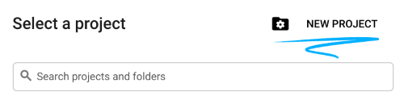
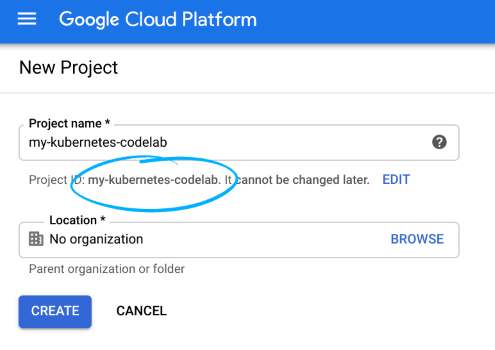
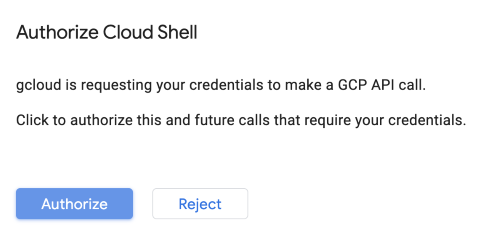
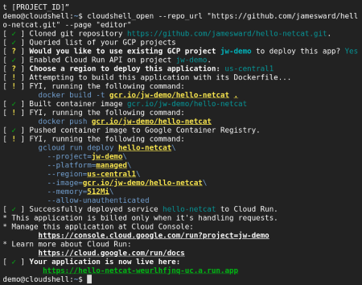

summary: Deploy with GCP
id: docs
categories: Tutorial
tags: RPT
status: Published
authors: Kang
Feedback Link: https://github.com/kangyuw/pop_documentation

# Deploy with GCP
<!-- ------------------------ -->
## Introduction 
Duration: 3

### What You’ll Learn

Welcome to TBD!

Let's get to know how GCP - Google Cloud Platform help developers to deploy their projects with automatically pipeline.

This event will walk through the following steps.

- Create a new project on GCP
- Deploy the microservice on Cloud Run
- Buildup automatic pipeline on Cloud Run

At the end of the event, you have to submit your microservice to the **Leaderboard**.

#### Leader board

<!-- The picture of the Leaderboard -->

The host will send the HTTP POST request. And the microservice should response with the following JSON structure:

```JSON
{
  "username": "Kang", //The registered username
  "flag": "jplOsDIaFLhcMRlS" //The 16-word random generated string
}
```

After the host receive the JSON response. It will update the leaderboard.

<!-- ------------------------ -->
## Login to Google Cloud
Duration: 5

To be able to deploy your microservice on Cloud Run you will need to login to Google Cloud. We will apply a credit to your account and you won't need to enter a credit card. It is usually less problematic to use a personal account (e.g. gmail.com) instead of a GSuite account because sometimes GSuite admins prevent their users from using certain Google Cloud features. Also, the web console we will be using should work great with Chrome or Firefox but might have issues in Safari.

[Get started and login](http://www.google.com)

<!-- ------------------------ -->
## Create a new Project
This section covers everything you need to do to get started with this event.

### Environment setup

Sign in to [Cloud Console](console.cloud.google.com) and create a new project.







Remember the project ID, a unique name across all Google Cloud projects. It will be referred to later in this codelab as ```PROJECT_ID```.

Be sure to follow any instructions in the "Cleaning up" section which advices you how to shut down resources so you don't incur billing beyond this event. New users of Google Cloud are eligible for the [$300 USD Free Trial](https://cloud.google.com/free) program.

### Start Cloud Shell

In this event you're going to work in a [Cloud Shell](https://cloud.google.com/shell) session, which is a command interpreter hosted by a virtual machine in Google's cloud. You could just as easily run this section locally on your own computer, but using Cloud Shell gives everyone access to a reproducible experience in a consistent environment.

Positive
: **Note**: The first time you make a request in Cloud Shell requiring authorization, you will see an "Authorize Cloud Shell" dialog like the one shown below, to which you may safely click the "Authorize" button.



#### Activate Cloud Shell

1. From the Cloud Console, click Activate Cloud Shell


If you've never started Cloud Shell before, you're presented with an intermediate screen (below the fold) describing what it is. If that's the case, click **Continue** (and you won't ever see it again). Here's what that one-time screen looks like:


It should only take a few moments to provision and connect to Cloud Shell.


This virtual machine is loaded with all the development tools you need. It offers a persistent 5GB home directory and runs in Google Cloud, greatly enhancing network performance and authentication. Much, if not all, of your work in this codelab can be done with simply a browser or your Chromebook.

Once connected to Cloud Shell, you should see that you are already authenticated and that the project is already set to your project ID.

2. Run the following command in Cloud Shell to confirm that you are authenticated:

``` bash
gcloud auth list

```

**Command output**
``` console
 Credentialed Accounts
ACTIVE  ACCOUNT
*       <my_account>@<my_domain.com>

To set the active account, run:
    $ gcloud config set account `ACCOUNT`
```

Positive
: **Note**: For more information about ```gcloud``` command-line tool, see [gcloud command-line tool overview](https://cloud.google.com/sdk/gcloud/).

1. Run the following command in Cloud Shell to confirm that the gcloud command knows about your project:

``` bash
gcloud config list project
```

**Command output**
``` console
[core]
project = <PROJECT_ID>
```

If it is not, you can set it with this command:

``` bash
gcloud config set project <PROJECT_ID>
```

**Command output**
``` console
Updated property [core/project].
```

OK, now you are ready to deploy the microservice!

<!-- ------------------------ -->
## Deploy Your Microservice

You can build your microservice with any technology and deploy it anywhere as long as it is reachable publicly and conforms to the API. But to make things easy we will help you start from a sample service and deploy it on Cloud Run.

#### Pick Your Sample to Start with

<!-- TODO: This part should contain our own setup samples -->
There are numerous sample microservices you can start from:

|Sample|Description|Deploy|
|---|---|---|
|[go](go)|Go Lang|[Run on Google Cloud](https://deploy.cloud.run/?git_repo=https://github.com/GoogleCloudPlatform/cloudbowl-microservice-game.git&dir=samples/go)|
|[java-quarkus](java-quarkus)|Java + Quarkus|[Run on Google Cloud](https://deploy.cloud.run/?git_repo=https://github.com/GoogleCloudPlatform/cloudbowl-microservice-game.git&dir=samples/java-quarkus)|
|[java-springboot](java-springboot)|Java + Spring Boot|[Run on Google Cloud](https://deploy.cloud.run/?git_repo=https://github.com/GoogleCloudPlatform/cloudbowl-microservice-game.git&dir=samples/java-springboot)|
|[kotlin-micronaut](kotlin-micronaut)|Kotlin + Micronaut|[Run on Google Cloud](https://deploy.cloud.run/?git_repo=https://github.com/GoogleCloudPlatform/cloudbowl-microservice-game.git&dir=samples/kotlin-micronaut)|
|[kotlin-quarkus](kotlin-quarkus)|Kotlin + Quarkus|[Run on Google Cloud](https://deploy.cloud.run/?git_repo=https://github.com/GoogleCloudPlatform/cloudbowl-microservice-game.git&dir=samples/kotlin-quarkus)|
|[kotlin-springboot](kotlin-springboot)|Kotlin + Spring Boot|[Run on Google Cloud](https://deploy.cloud.run/?git_repo=https://github.com/GoogleCloudPlatform/cloudbowl-microservice-game.git&dir=samples/kotlin-springboot)|
|[nodejs](nodejs)|Node.js|[Run on Google Cloud](https://deploy.cloud.run/?git_repo=https://github.com/GoogleCloudPlatform/cloudbowl-microservice-game.git&dir=samples/nodejs)|
|[python](python)|Python + Flask|[Run on Google Cloud](https://deploy.cloud.run/?git_repo=https://github.com/GoogleCloudPlatform/cloudbowl-microservice-game.git&dir=samples/python)|
|[scala-play](scala-play)|Scala + Play Framework|[Run on Google Cloud](https://deploy.cloud.run/?git_repo=https://github.com/GoogleCloudPlatform/cloudbowl-microservice-game.git&dir=samples/scala-play)|

After you decide which sample to start with, click the "Deploy on Cloud Run" button above. This will launch [Cloud Shell](https://cloud.google.com/shell) (a web-based console to a virtual machine in the cloud) where the source will be cloned, then built into a deployable package (a docker container image), which is then uploaded to the [Google Container Registry](https://cloud.google.com/container-registry), and then deployed on [Cloud Run](https://cloud.google.com/run).

When asked, specify the ```us-central1``` region.

The screenshot below shows Cloud Shell output for microservice build and deployment



#### Verify the microservice works

In Cloud Shell you can make a request to your newly deployed microservice, replacing YOUR_SERVICE_URL with the URL for your service (which is in Cloud Shell after the "Your application is now live here" line):

<!-- TODO: This part should be replace by simple http post request -->

``` console
curl -d '{
  "_links": {
    "self": {
      "href": "https://foo.com"
    }
  },
  "arena": {
    "dims": [4,3],
    "state": {
      "https://foo.com": {
        "x": 0,
        "y": 0,
        "direction": "N",
        "wasHit": false,
        "score": 0
      }
    }
  }
}' -H "Content-Type: application/json" -X POST -w "\n" \
  https://YOUR_SERVICE_URL
```

You should see the response string of either ```F```, ```L```, ```R```, or ```T```.

<!-- ------------------------ -->
## Make Changes

<!-- ------------------------ -->
## Join the Leaderboard

<!-- ------------------------ -->
## Delivery

<!-- ------------------------ -->

## Congratulations

Congratulations, you've successfully built and deployed a microservice. Good luck!

#### Reference Docs

+ [Cloud Run Docs](https://cloud.google.com/run/docs/)